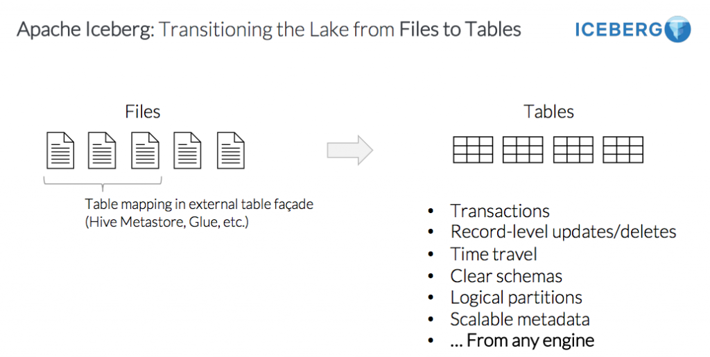
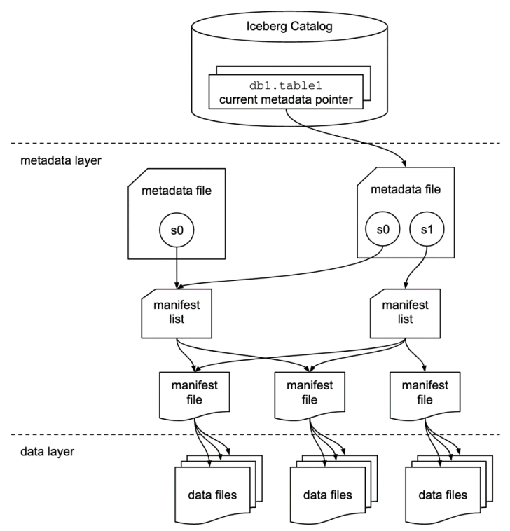
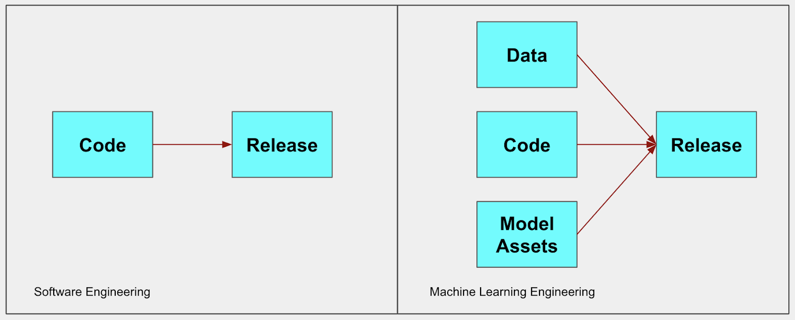

# Apache Iceberg with Spark 3 in Cloudera Machine Learning

CDW and CDE now support Apache Iceberg, a new table format for huge analytic datasets in
the cloud. Iceberg enables you to work with large tables, especially on object stores, and
supports concurrent reads and writes on all storage media. You can also use Iceberg in CML
with the Spark 3 Runtime. This project shows a simple PySpark example in Jupyter Notebooks.

You can use Iceberg when a single
table contains tens of petabytes of data, and you can read these huge tables without any
compromise on performance. Currently Iceberg is supported on HDFS and S3. Iceberg also
removes multiple challenges around partition pruning.

Iceberg introduced the idea of a table format rather than a file format. 
A file format is however you decided to put bits into a file. 
A table format is how you put individual data files and bundle them together to have the high level concept of a table. 

Iceberg uses snapshots to guarantee isolated reads and writes. Readers always see a
consistent version of the data without the need to lock the table. Writers work in isolation, not
affecting the live table, and perform a metadata swap only when the write is complete, making
the changes in one atomic commit.

A snapshot is a complete listing of all the files in a table at a particular time. 
Each single atomic operation produces a new snapshot. This leads to snapshot isolation 
i.e. any change to the file list is an atomic operation.
Files are immutable just like in Hive. So a new writer creates a new listing 
and swaps the pointer to the current state of the table.

Depending on your environment you can create an Iceberg table using Hive, Impala or Spark.

One of Iceberg's most anticipated features is Time Travel, giving Machine Learning practictioners 
the ability to roll back datasets to previous states. In the context of MLOps this is a crucial component 
of Reproducible Machine Learning pipelines.

Software Engineering is deterministic while Machine Learning is stochastic. This means that the same inputs
to a Machine Learning model will probably yield different outputs at different times. 
Being able to relate a model's metadata, packaging, as well as data used for training and experimentation 
in its original state is a crucial best practice for Machine Learning production and regulatory compliance. 

## Project Contents

This project provides an introductory example for using Iceberg with a Spark 3 session in CML. 

The Quickstart Notebook shows how to correctly launch a Spark Session with Iceberg, create an Iceberg table, 
and query the data in its original state before a simple insert.

To execute the notebook, launch a new CML session and choose "JupyterLab" as Editor and make sure to enable Spark 3. 

